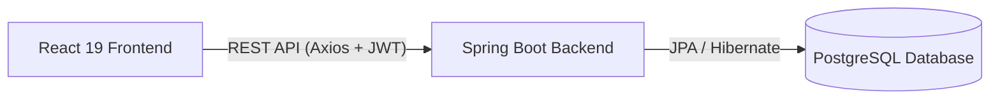

# 🏫 Al-Manard3s - Système de Gestion Scolaire Bilingue

[](https://spring.io/projects/spring-boot)
[](https://react.dev/)
[](https://www.typescriptlang.org/)
[](https://www.postgresql.org/)
[](https://tailwindcss.com/)
[](https://getbootstrap.com/)

**Al-Manard3s** est une solution numérique moderne de gestion scolaire bilingue (Français/Arabe) développée sous forme d'application web. Elle est conçue pour accompagner l'administration d'un établissement d'enseignement dans son pilotage quotidien, en centralisant la gestion administrative, financière et pédagogique (notamment le suivi de la récitation du Coran).

> [!NOTE]
> Dans ce dépôt GitHub, le projet est organisé en branches :
> *   **Branche `principal`** : Contient le code source du **Backend** (Spring Boot + PostgreSQL).
> *   **Branche Frontend** : Contient le code source du **Frontend** (React + Vite + Tailwind CSS).

---

## 📌 Sommaire

1. [Définition du Projet](#1-définition-du-projet)
2. [Problématique Résolue](#2-problématique-résolue)
3. [Comment le Projet Résout ces Problèmes](#3-comment-le-projet-résout-ces-problèmes)
4. [Apport Métier et Bénéfices](#4-apport-métier-et-bénéfices)
5. [Architecture Technique](#5-architecture-technique)
6. [Installation et Configuration](#6-installation-et-configuration)
7. [Sécurité et Rôles Utilisateurs](#7-sécurité-et-rôles-utilisateurs)
8. [Structure du Projet (Branche `principal`)](#8-structure-du-projet)

---

## 1. Définition du Projet

**Al-Manard3s** est un système de gestion scolaire complet permettant de piloter efficacement les activités quotidiennes d'une école. Il est organisé autour de modules fonctionnels clés :
*   **Gestion des élèves** (profils, inscriptions).
*   **Gestion des parents** (informations de contact, suivi).
*   **Gestion des classes et des niveaux**.
*   **Suivi financier** (frais de scolarité, encaissements, reçus PDF, situations d'impayés).
*   **Suivi des dépenses** de l'établissement.
*   **Module Coran** (suivi des séances de récitation, mémorisation et statistiques de progression).

L'application propose un **double portail** :
*   Un portail en **Français** pour la gestion administrative, financière et générale.
*   Un portail en **Arabe** (avec direction de texte de droite à gauche - RTL) dédié aux activités pédagogiques et à la récitation du Coran.

---

## 2. Problématique Résolue

Avant cette solution, la gestion scolaire reposait souvent sur des documents papier, des fichiers Excel dispersés et des processus manuels de suivi des paiements. **Al-Manard3s** résout ainsi :
*   **La perte et la dispersion des données** : toutes les informations sont centralisées.
*   **La lenteur opérationnelle** : recherche d'informations sur un élève ou sa classe en un clic.
*   **Le manque de visibilité financière** : détection automatique des impayés et des paiements partiels.
*   **La complexité du suivi pédagogique** : centralisation des progrès de mémorisation du Coran par élève et par classe.

---

## 3. Comment le Projet Résout ces Problèmes

### a) Centralisation des données
Toutes les données (élèves, parents, finances, notes de mémorisation) résident dans une base de données relationnelle unique, sécurisée et accessible en temps réel.

### b) Interfaces métiers dédiées
Des écrans clairs et modernes sont adaptés à chaque tâche : formulaires d'inscriptions, tableaux de suivi de mémorisation, formulaires d'enregistrement de dépenses ou paiements.

### c) Tableaux de bord dynamiques
Un tableau de bord interactif fournit des statistiques globales en temps réel :
*   Effectifs totaux des élèves.
*   Total des paiements encaissés.
*   Total des dépenses enregistrées.
*   Indicateurs visuels sur les situations financières (impayés).

### d) Pilotage financier rigoureux
Enregistrement direct des versements avec calcul automatique du reste à payer, possibilité d'éditer des reçus PDF professionnels grâce à l'intégration de `jsPDF`.

### e) Portail bilingue et support RTL
*   Le portail arabe exploite la police **Amiri** pour un rendu premium et respecte la mise en page **RTL (Right-to-Left)**.
*   Le portail français propose un affichage standard **LTR (Left-to-Right)** fluide avec une barre latérale de navigation ergonomique.

---

## 4. Apport Métier et Bénéfices

*   **Gain de temps substantiel** pour l'équipe administrative grâce à l'automatisation des tâches répétitives.
*   **Précision financière accrue** grâce au suivi automatique des échéances de paiement et au contrôle des dépenses.
*   **Suivi pédagogique personnalisé** en proposant un historique détaillé des récitatifs du Coran, favorisant le suivi individuel et la communication avec les parents.
*   **Image professionnelle modernisée** pour l'établissement vis-à-vis des parents et des partenaires externes.

---

## 5. Architecture Technique

Le projet adopte une architecture découplée **Client / Serveur** moderne :



### ⚙️ Backend (Cette branche)
*   **Framework** : Spring Boot 4.0.6 (Java 17)
*   **Sécurité** : Spring Security (OAuth2 Client & implémentation JWT personnalisée)
*   **Persistance** : Spring Data JPA / Hibernate
*   **Validation** : Jakarta Validation (Hibernate Validator)
*   **Base de données** : PostgreSQL

### 💻 Frontend (Autre branche)
*   **Framework** : React 19 (avec TypeScript)
*   **Build Tool** : Vite
*   **Mise en page & Design** : Tailwind CSS v4 & Bootstrap 5
*   **Gestion des Requêtes** : React Query (TanStack Query v5) & Axios
*   **Visualisation** : Recharts & Chart.js (graphiques interactifs)

---

## 6. Installation et Configuration (Backend)

### 📋 Prérequis
*   [Java JDK 17](https://www.oracle.com/java/technologies/downloads/) installé et configuré dans votre `PATH`.
*   [PostgreSQL](https://www.postgresql.org/download/) installé et en cours d'exécution.

---

### 🗄️ Étape 1 : Configuration de la Base de Données

1. Créez une base de données PostgreSQL nommée `gestionscolaire` :
   ```sql
   CREATE DATABASE gestionscolaire;
   ```
2. Si vous possédez le fichier de sauvegarde SQL, vous pouvez restaurer le schéma :
   ```bash
   psql -U postgres -d gestionscolaire -f gestionscolaire.sql
   ```

---

### ⚙️ Étape 2 : Configuration et Lancement du Backend

Le dossier du backend se trouve dans `GestionScolaire`.

1. Modifiez le fichier de configuration `GestionScolaire/src/main/resources/application.properties` si vous devez adapter les identifiants de votre base de données :
   ```properties
   spring.datasource.url=jdbc:postgresql://localhost:5432/gestionscolaire
   spring.datasource.username=votre_utilisateur
   spring.datasource.password=votre_mot_de_passe
   ```
2. Démarrez l'application Spring Boot :
   * **Sous Windows** :
     ```cmd
     mvnw.cmd spring-boot:run
     ```
   * **Sous macOS / Linux** :
     ```bash
     chmod +x mvnw
     ./mvnw spring-boot:run
     ```
   Le serveur backend sera disponible sur le port **`http://localhost:8080`**.

---

## 7. Sécurité et Rôles Utilisateurs

Le système sécurise les accès à l'aide de jetons **JSON Web Tokens (JWT)**. L'authentification se fait sur deux axes de connexion :
*   **Accès Administratif & Comptable (Français)** : Connecte l'utilisateur et le redirige vers le tableau de bord français (`/dashboard`).
*   **Accès Enseignant Coran (Arabe)** : Connecte l'utilisateur et le redirige vers le portail arabe (`/ar/dashboard`).

### Matrice des Droits et Habilitations

| Rôle | Dashboard FR | Portail AR (Coran) | Gestion Inscriptions & Élèves | Paiements & Factures | Gestion Dépenses |
| :--- | :---: | :---: | :---: | :---: | :---: |
| **ADMIN** | ✅ | ✅ | ✅ | ✅ | ✅ |
| **COMPTABLE** | ✅ | ❌ | ✅ | ✅ | ✅ |
| **ENSEIGNANT** | ✅ | ✅ | ✅ (Consultation) | ❌ | ❌ |

---

## 8. Structure du Projet (Branche `principal`)

```text
GestionScolaireALMANARD (Branch: principal)
│
├── .idea/                              # Fichiers de configuration IDE
│
├── GestionScolaire/                    # Projet Spring Boot
│   ├── src/
│   │   ├── main/
│   │   │   ├── java/com/example/GestionScolaire/
│   │   │   │   ├── Config/             # Configurations (Securité JWT, CORS)
│   │   │   │   ├── Controller/         # Controlleurs REST API
│   │   │   │   ├── DTO/                # Objets de transfert de données
│   │   │   │   ├── Model/              # Entités JPA (Eleve, Parent, Seance, etc.)
│   │   │   │   ├── Repository/         # Interfaces d'accès à la BDD
│   │   │   │   └── Service/            # Logique métier
│   │   │   └── resources/              # Fichiers de configuration (properties)
│   │   └── test/                       # Tests unitaires et d'intégration
│   │
│   ├── pom.xml                         # Dépendances Maven (Spring Boot, JWT, PostgreSQL, Lombok)
│   ├── mvnw                            # Script de lancement Maven (Linux/macOS)
│   └── mvnw.cmd                        # Script de lancement Maven (Windows)
│
└── README.md                           # Documentation générale du projet
```

---

## 📄 Licence

Copyright © 2026 Al-Manard3s - Tous droits réservés.  
Développé dans le cadre de la modernisation de la gestion scolaire de l'établissement Al-Manard3s.
